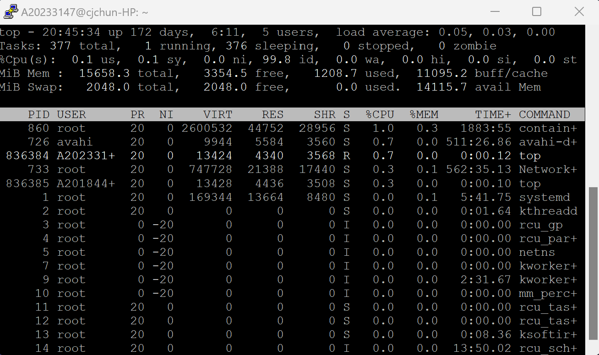
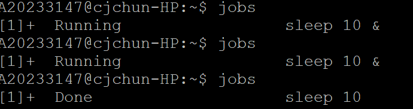
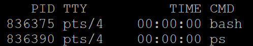
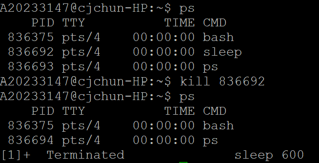

# top 명령어


- 위 이미지는 top명령어를 실행해, top모드에 진입한 화면입니다.
- `top`은 실행 중인 프로세스들을 실시간으로 모니터링합니다, 필요에 따라 정렬 및 필터링이 가능합니다.

- 대표적으로 표시되는 정보

 1. 프로세스 ID (PID): 각 프로세스에 할당된 고유한 식별자입니다.
 2. 사용자 (USER): 프로세스를 실행하는 사용자의 이름 또는 ID입니다.
 3. CPU 사용량 (%CPU): 프로세스가 CPU를 얼마나 사용하고 있는지 백분율로 표시됩니다.
 4. 메모리 사용량 (%MEM): 프로세스가 시스템 메모리의 얼마나 사용하고 있는지 백분율로 표시됩니다.
 5. 프로세스 상태 (S): 프로세스의 현재 상태를 나타냅니다. ex) 실행 중(Running), 정지(Stopped), 대기 중(Waiting)

- 일반적으로 사용하는 키


- q : top모드를 종료합니다.
- d or s : top에 표시되는 정보들의 업데이트 주기를 변경합니다.
- 1 : 다중 CPU 시스템에서 CPU별 사용량을 표시합니다.
- k : 프로세스를 종료하기 위해 프로세스 ID를 입력할 수 있는 프롬프트를 제공합니다. (kill)
- esc : 정보를 업데이트 합니다.
 
---
# jobs 명령어


- 위 이미지는 sleep 10 명령어를 백그라운드에서 실행한 후, jobs명령어로 확인한 결과입니다.
- `jobs`는 현재 실행 중인 백그라운드 작업의 목록을 표시합니다.

```
[작업번호] 직업상태 작업명령어
```

위 형식으로 표시합니다.

---
# ps 명령어



- `ps`는 실행 중인 프로세스의 정보를 표시합니다.
- 표시하는 정보
- PID (Process ID): 각 프로세스에 할당된 고유한 식별자입니다. PID를 사용하여 특정 프로세스를 식별할 수 있습니다.
- TTY (Terminal): 프로세스가 실행 중인 터미널 또는 유사한 장치의 이름입니다.
- STAT (Process State): 프로세스의 현재 상태를 나타냅니다. 실행(Running), 중지(Stopped), 대기(Waiting) 등의 상태가 있습니다.
- TIME (CPU Time): 프로세스가 CPU를 사용한 시간입니다.
- COMMAND (Command Name): 프로세스를 실행한 명령어 또는 프로그램의 이름입니다.

출력에 ps도 포함되는 이유는 ps 명령어 자체도 실행 중인 프로세스 중 하나이기 때문에, 기본적으로 ps 명령어의 출력에 나타납니다.

- 옵션
- -e or -A : 시스템 전체 프로세스를 표시합니다.
- -f : UID, PPID, PRI를 포함한 기존보다 자세한 정보들을 표시합니다.
---
# kill 명령어



-위 화면은 ps로 실행중인 프로세스(sleep)을 확인하고, kill로 종료한뒤, ps로 종료되었는지 확인한 화면입니다.

- `kill`은 프로세스를 종료하는 명령어입니다. 
- 사용법
```
kill [옵션] <PID 또는 작업 번호>
```

- 일반적으로 사용되는 옵션

  - -15 (SIGTERM) : 가장 일반적으로 사용되며, 프로세스에게 종료 요청을 보내고 Graceful하게 종료할수있는 기회를 줍니다.
  - Graceful한 종료란 종료하기 전에 추가 작업을 수행할 수 있는 시간을 가지고,
  - 다른 프로세스나 시스템에게 종료할 것을 알리고 자원을 해제하는 등의 정리 작업을 할 수 있습니다.
  - -9 (SIGKILL) : 프로세스를 강제종료 합니다.
  - -a : 모든 프로세스에 시그널을 보냅니다.

